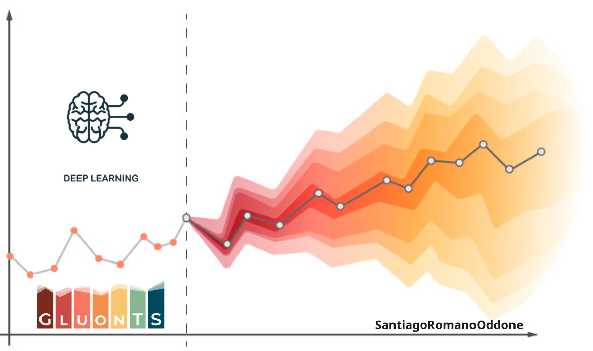

# 📊 Master Thesis: Forecasting Demand Across Products and Stores

## 🧠 Overview

This repository contains the final thesis project for my **Master’s in Management and Analytics**, where I designed and implemented a **scalable deep learning-based forecasting system** tailored for the **retail industry**. The goal was to tackle the real-world challenge of predicting demand across thousands of product-store combinations **accurately and efficiently**.

In retail, forecasting demand is a mission-critical task that directly impacts product availability, inventory optimization, and operational costs. This project proposes and validates a modeling strategy that leverages **deep learning architectures** to improve both **forecast quality** and **scalability**, showing that academic innovation can translate into significant business impact.

## 🚀 Project Objectives

- 📌 Develop a **forecasting framework** capable of processing multiple related time series per product to predict demand across all stores simultaneously.
- 📊 Compare several **modern deep learning models** with traditional baselines like **XGBoost**, under a rigorous evaluation pipeline.
- ⚙️ Build a scalable approach where **one model per product** learns from all its store-level series in parallel, reducing training complexity while capturing meaningful patterns.
- 📈 Quantify model performance across product clusters with **cluster-specific evaluations** and **real-world metrics** (e.g., RMSE, median error).

## 🧰 Methodology

At the core of this work is a custom modeling pipeline built using the **GluonTS library**, extended with logic developed to train deep learning models **per product**, using **all store-level time series jointly**. This design enables:

- ✅ Better pattern generalization across stores.
- ✅ Huge reductions in training time compared to building one model per product-store pair.
- ✅ Practical scalability for real-world deployments.

### Models Evaluated:

- **Simple Feedforward (MLP)** – strong baseline, often outperforming more complex models.
- **DeepAR** – autoregressive RNN for sequential patterns.
- **WaveNet** – dilated CNN for long-term dependencies.
- **Temporal Fusion Transformer (TFT)** – interpretable and powerful attention-based model.
- **XGBoost** – industry-standard machine learning benchmark.

## 🛒 Relevance to the Retail Industry

This approach was developed specifically for **retail forecasting at scale**, where thousands of product-store combinations must be predicted reliably and quickly. Key advantages of this approach include:

- ⏱️ **Efficiency**: One model per product instead of per store-product combination.
- 🔁 **Scalability**: Predict demand across all stores in parallel.
- 📉 **Accuracy**: Superior performance over traditional baselines like XGBoost.
- 📦 **Business Value**: Ideal for systems that automate replenishment decisions.

## 📈 Key Outcomes Achieved

- 🚀 The **Simple Feedforward model** consistently outperformed XGBoost across product clusters, achieving **lower RMSE and median error**.
- 📦 Successfully forecasted demand across **thousands of product-store combinations**, validating the framework’s scalability and robustness.
- ⚙️ Delivered a ready-to-use forecasting pipeline that can be integrated into **automated retail systems**.
- 💡 Extracted actionable insights on when and why deep learning models succeed, informing future architecture and feature choices.

---

**This thesis demonstrates that building a deep learning pipeline tailored for multi-store forecasting—using shared models per product—is not only feasible, but highly effective. It opens the door to better, faster, and smarter demand prediction in large-scale retail operations.**

Feel free to explore the notebooks, code, and results — or reach out if you're tackling similar challenges in retail or time series forecasting!

*santiagoro.com*
